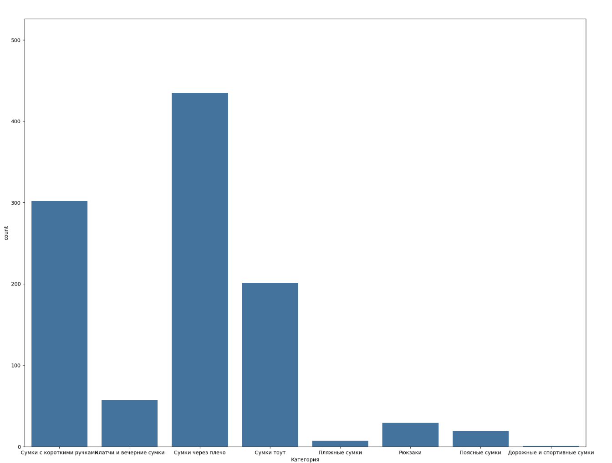
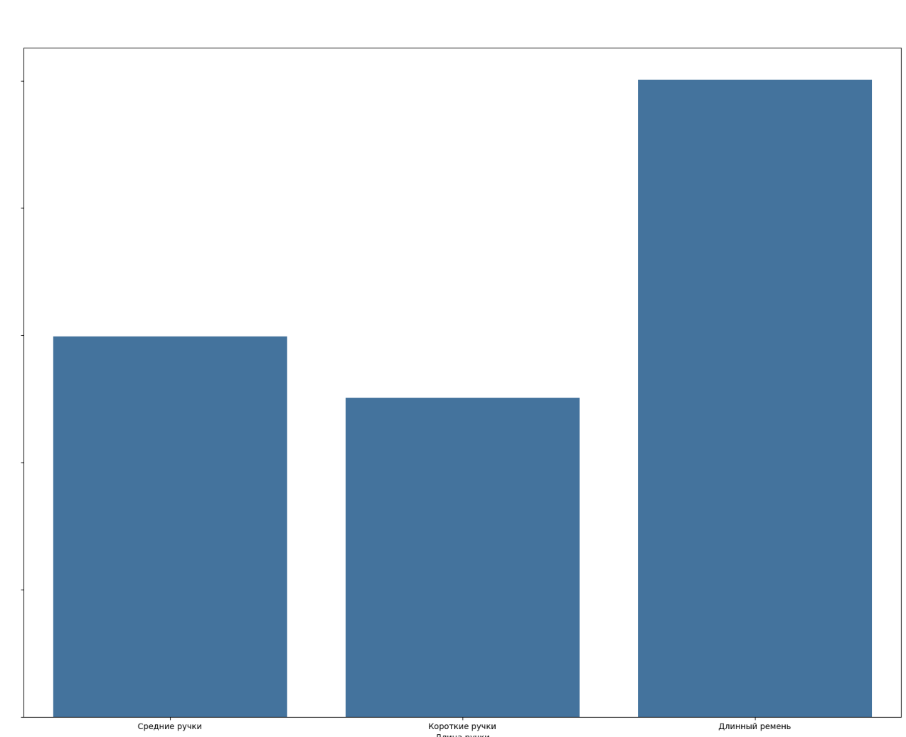

## Проект по эконометрике
#### Гедонистическая ценовая функция для брендовых сумок

##### Подготовили Джанбекова Алина, Красногорова Лилия, Эшмеев Павел 

### Переменные и их источник 
Источником данных послужил сайт https://oskelly.ru/catalog/zhenskoe/sumki
Все переменные получаем из парсинга страницы товара в разделе детали, после чего убираем лишние и заполняем пропуски

Переменные для анализа: 
**Категориальные:**
- Размер - размер сумки (категориальный признак) 
Если не был указан размер, то INT U - универсальный
- Категория - тоут/через плечо/с короткими ручками/рюкзаки/клатчи/аксессуары для сумок (категориальный признак) 
Не было пропущенных данных 
- Бренд - бренд сумки (категориальный признак)
Не было пропущенных данных 
- Материал сумок (категориальный признак)
Не было пропущенных данных 
- Цвет - цвет сумки (категориальный признак)
Не было пропущенных данных 
- Длина ручки (категориальный признак)
Не было пропущенных данных 
- Состояние товара (категориальный признак)
Не было пропущенных данных 
- Продавец (категориальный признак)
Не было пропущенных данных 
- Модель (категориальный признак)
Если не была указана, то заполнили Ordinary 

**Бинарные:**
Для них, если указано "Да" на сайте, то указываем 1
Иначе (пустые) - указываем 0 
- Наличие пыльника (бинарный признак)
- Винтаж - является ли сумка винтажной (бинарный признак)
- Наличие коробки (бинарный признак)
- Наличие сертификата (бинарный признак)

**Целевая переменная:**
- Цена - цена сумки, рубли.

### Анализ переменных 

Как видно из графика, самыми распространенныеми брендами сумок на сайте оказались Hermes, Louis Vuitton, Gucci, Chanel и Bottega Veneta. Cреди наиболее редко встречающихся брендов сумок на вторичном рынке присутствуют бренды более бюджетного сегмента. Подобные результаты связаны с тем, что осталась возможность приобрести эти бренды в России, например, на Ламоде или в бутиках. Но также среди менее популярных оказались и дорогие бренды с длинной истоией, например, Goyard, о котором модники в России узнали судя по всему не так давно.

Итак, посмотрев на распределение количества сумок по категориям, нетрудно сделать вывод о популярности сумок через плечо, которые являются зачастую самыми бюджетными из-за небольшого размера и достаточно удобными. Но также достаточно много сумок с короткими ручками и сумок тоут.

Распределение же сумок относительно длины ручки показывает, что самыми распространенными являются сумки на длинном ремне, что соответствует результатам по категориям сумок.
