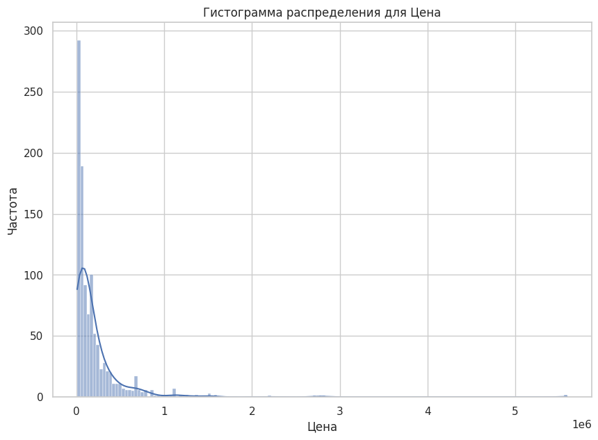
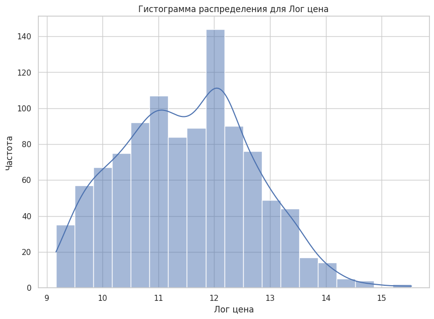
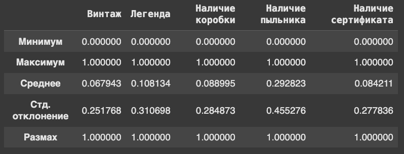
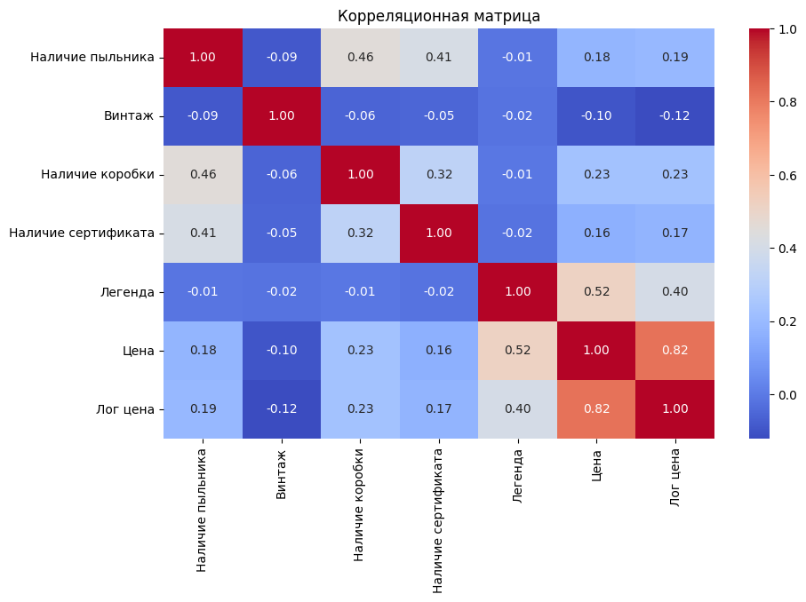
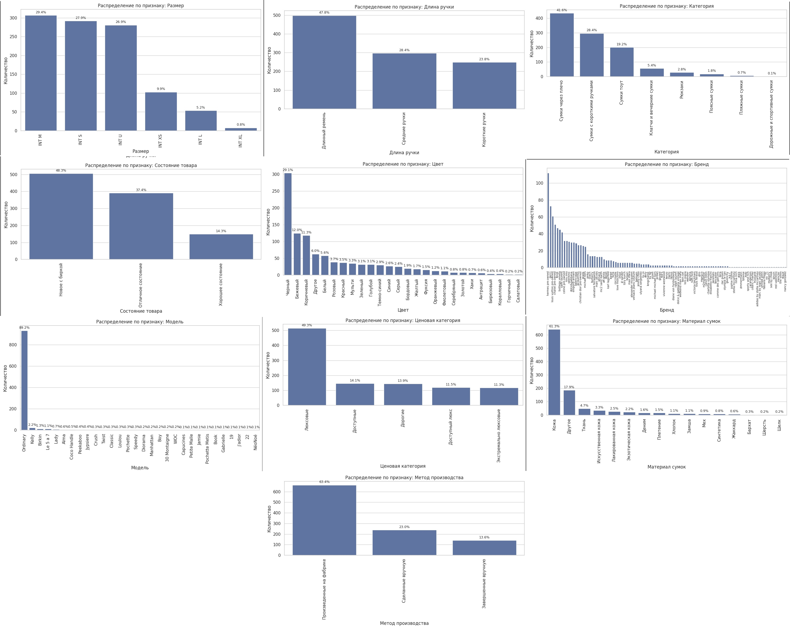
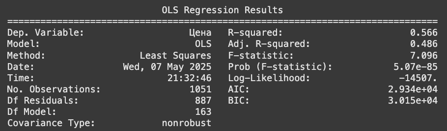
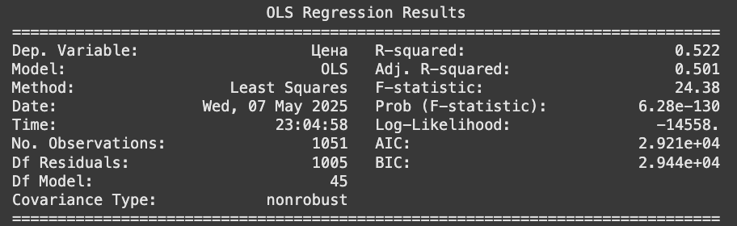
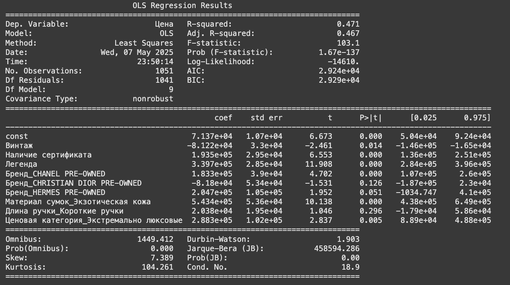
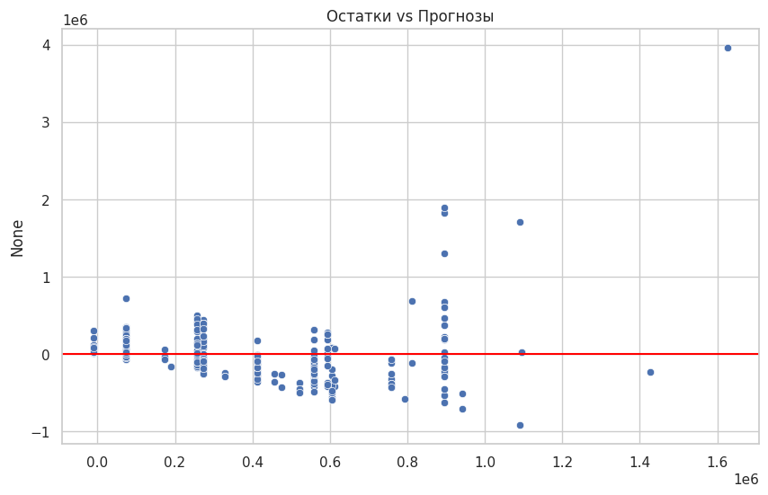
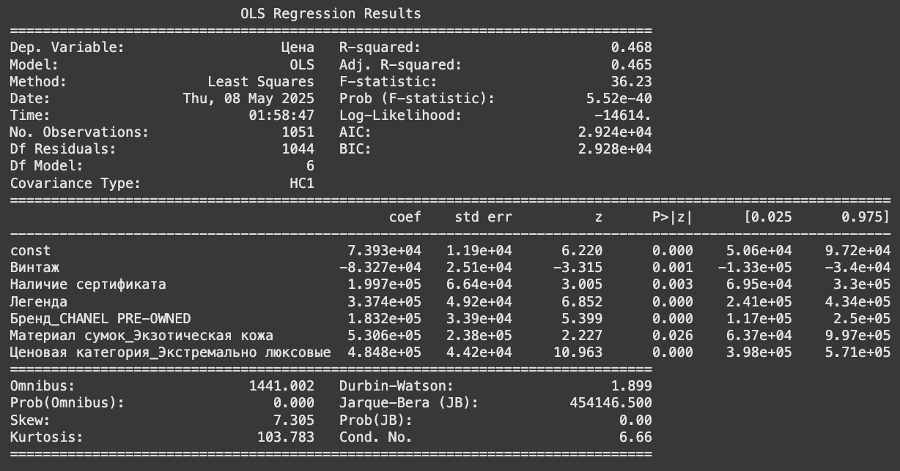

## Проект по эконометрике
#### Гедонистическая ценовая функция для брендовых сумок

##### Подготовили Джанбекова Алина, Красногорова Лилия, Эшмеев Павел 

Заранее оговоримся, что проверка всех гипотез в нашем исследовании будет проходить на 5% уровне значимости.

### Переменные и их источник 
Источником данных послужил сайт https://oskelly.ru/catalog/zhenskoe/sumki
Все переменные получаем из парсинга страницы товара в разделе детали, после чего убираем лишние и заполняем пропуски

Переменные для анализа: 
**Категориальные:**
- Размер - размер сумки (категориальный признак) </
Если не был указан размер, то INT U - универсальный
- Категория - тоут/через плечо/с короткими ручками/рюкзаки/клатчи/аксессуары для сумок (категориальный признак) 
Не было пропущенных данных 
- Бренд - бренд сумки (категориальный признак)
Не было пропущенных данных 
- Материал сумок (категориальный признак)
Не было пропущенных данных 
- Цвет - цвет сумки (категориальный признак)
Не было пропущенных данных 
- Длина ручки (категориальный признак)
Не было пропущенных данных 
- Состояние товара (категориальный признак)
Не было пропущенных данных 
- Продавец (категориальный признак)
Не было пропущенных данных 
- Модель (категориальный признак)
Если не была указана, то заполнили Ordinary 
- Ценовая категория (в зависимости от бренда на основе графика распределения цен в зависимости от бренда)
Экстремально люксовые - 'BVLGARI', 'HERMES PRE-OWNED'
Люксовые -  'BALENCIAGA', 'BURBERRY', 'GOYARD' и тд (в коде можно посмотреть)
Доступный люкс - 'VALENTINO', 'DOLCE&GABBANA', 'JACQUEMUS' и тд (в коде можно посмотреть)
Дорогие - 'MARC JACOBS', 'VERSACE', 'A.P.C.' и тд (в коде можно посмотреть)
Доступные - остальные 
- Метод производства (было проведено исследование, какие бренды как делают свои сумки)
Сделанные вручную - 'HERMES PRE-OWNED', 'CHRISTIAN DIOR PRE-OWNED', 'BOTTEGA VENETA', 'LOEWE', 'FENDI'
Завершенные вручную - 'GUCCI','SAINT LAURENT', 'JACQUEMUS'
Произведенные на фабрике - остальные 

**Бинарные:**
Для них, если указано "Да" на сайте, то указываем 1
Иначе (пустые) - указываем 0 
- Наличие пыльника (бинарный признак)
- Винтаж - является ли сумка винтажной (бинарный признак)
- Наличие коробки (бинарный признак)
- Наличие сертификата (бинарный признак)
- Легенда (бинарный) 
Если модель не Ordinary, то является легендарной моделью бренда

**Целевая переменная:**
- Цена - цена сумки, рубли.

### Анализ переменных 
#### Целевая переменная 
**Цена**

Скошенность: 8.049594378924823
Островершинность: 99.60939372241275

По построенному графику видно, что цены сумок распределены с очень длинным правым хвостом и тяжёлым левым хвостом. Показатель скошенности равный примерно 8 (при значении 0 для нормального распределения) говорит о сильной асимметрии: большинство товаров сконцентрировано внизу ценовой шкалы, но небольшое число лотов стоит в разы дороже и тянет распределение вправо. Островершинность около 100 (при показателе 3 у нормального распределения) означает, что вероятность появления экстремально высоких и низких цен намного выше, чем при нормальном распределении, то есть для выборки присуща высокая частота выбросов. Вероятно распределение прологарифмированной цены будет выглядеть сильно лучше. Взглянем на него.

**Логарифм цены**
Скошенность: 0.15836535158553108 
Островершинность: -0.4665477186972127 

Видим, что в данном случае все сильно лучше. Показатель скошенности близкий к 0 говорит о почти симметричном распределении. Показатель -0.47 островершинности указывает на плоское распределение с менее выраженными пиками и более тонкими хвостами по сравнению с нормальным распределением. По данным показателям можно сказать, что распределение близко к нормальному.

И на графике распределения обычных цен, и на графике распределения логарифмированных цен в правом хвосте имеются ненулевые столбцы, растягивающие его. C помощью анализа ящиков с усами убрали выбросы (цена больше 2000000)

средняя стоимость рассматриваемых моделей составила 202.5 тыс. рублей
стандартное отклонение стоимости довольно велико и составляет примерно 363 тыс. рублей
размах цен сумок довольно большой - от 9 тыс. до 5.6 млн. рублей

#### Дамми-переменные 

Выводы:
- лишь у 8% сумок из выборки имеется сертификат
- пыльник присутствует примерно у 30% рассматриваемых моделей
- только 9% из всех сумок в выборке поставляются в коробках
- винтажных сумок всего 6% от всей выборки

Из численных переменных лучше всего с ценой коррелирует наличие легенды. Другие параметры коррелируют со стоимостью довольно слабо.

#### Категориальные переменные

Почти для всех категориальных переменных видно, что большая часть данных приходится лишь на несколько категорий, даже если их довольно много для данного параметра. Логичной идеей является объединение классов для их более равномерного распределения по выборке, что позволило бы сделать оценки моделей более устойчивыми. Но важно также учитывать, что при склейке разных по средней цене групп мы искусственно повышаем шум внутри переменной, что впоследствии уменьшает долю объяснённой дисперсии. Кроме того при объединении отличающихся по цене категорий неучтённая разница в их цене перекладывается на ошибку модели, что увеличивает гетероскедастичность.

Отдельно можно выделить характеристику "Модель" - почти все объекты имеют показатель "Ordinary" по данному параметру. Кажется, что не имеет особого смысла использовать данную характеристику для построения моделей, так как она не будет вносить какой-либо значимой дополнительной информации об объектах. Убираем ее из выборки.

Для других характеристик, в которых хотелось бы провести некоторые склейки разных классов, c помощью ящиков с усами для разных категорий относительно их стоимости и посмотрим возможно ли теоретически объединить категории: у многих классов значения средних различаются, из-за чего их объединение статистически ухудшит результаты моделей.

Из того, что теоретически возможно слить можно выделить размеры сумок L и XL - судя по ящикам с усами их параметры схожи. Проверим это с помощью t-теста Уэлча и U-теста Манна-Уитни (использовать будем логарифм цены, так как ее распределение ближе к нормальному и не скошено в одну сторону).

**Levene: p‑value = 0.5926
Welch t‑test: t = 0.184,  p-value = 0.8570
Mann‑Whitney U‑test: U = 209,  p-value = 0.8914**

Нет статистически значимой разницы средних лог‑цен (p > 0.05). Размеры L и XL можно считать однородными по цене, поэтому мы их объединяем.

### Эконометрические модели 
Для использования категориальных характеристик в дальнейших моделях, преобразуем их с помощью One Hot Encoder.

#### Линейная регрессия

Статистически значимыми оказались 
Бинарный: Винтаж, Наличие сертификата, Легенда
Категориальные: Бренд CHANEL PRE-OWNED, Бренд CHRISTIAN DIOR PRE-OWNED, Бренд HERMES PRE-OWNED,
Экзотическая кожа,
Короткие ручки, Экстремально люксовые

Отрицательно влияют на цену: Винтаж (в среднем уменьшает стоимость на -102900 рублей), Бренд CHRISTIAN DIOR PRE-OWNED(-111400), Короткие ручки (-54590)

Положительно влияют на цену: Наличие сертификата (в среднем увеличивает стоимость на 93870 рублей), Легенда (в среднем увеличивает стоимость 360100), Бренд CHANEL PRE-OWNED (131200), Бренд HERMES PRE-OWNED (303500), Экзотическая кожа (573700), Экстремально люксовые (352800)

**Мультиколлинеарность**: есть показатели  𝑉𝐼𝐹 > 10 следовательно, присутствует 

#### МГК
Изначально берем все главные компоненты и оцениваем на них линейную регрессию. Незначимые главные компоненты удаляем, остальные оставляем (значимых осталось только 45).

Получилось, что все параметры в новом параметрическом пространстве имеют $VIF < 10$, то есть мультиколлинеарность в такой выборке отсутствует. При этом $Adj. R^2$, $AIC$ и $BIC$ у модели со значимыми главными компонентами лучше чем у первоночальной модели линейной регрессии ($0.501 > 0.486$, $2921 < 2934$, $2944 < 3015$ соответственно). К сожалению, при использовании подобного рода данных интерпретировать результаты модели не представляется возможным, поэтому попробуем рассмотреть модель линейной регрессии только со значимыми характеристиками.

#### Линейная регрессия со статистически значимыми

Статистически значимые: const,
 Винтаж (цена в среднем -81220 рублей),
 Наличие сертификата (+193500),
 Легенда (+339700),
 Бренд CHANEL PRE-OWNED (+183300),
 Экзотическая кожа (+543400),
 Экстремально люксовые (+288300)

Вновь уберем статистически не значимые переменные 

Как видим, здесь уже все коэффициенты значимы. При этом $Adj. R^2$ все же хуже чем у самой полной модели, но $AIC$ и $BIC$ меньше. Теперь проверим получившуюся модель на мультиколлинеарность.

**Мультиколлинеарность** в данной модели отсутствует (VIF < 10).

**Гетероскедастичность**:

Кажется, на графике не наблюдается зависимость разброса остатков от прогнозных значений и средний уровень остатков во всех частях графика не равен нулю, то есть вероятнее в модели не наблюдается гетероскедастичность. При этом похоже, средний уровень остатков зависит от прогнозных значений, что говорит о возможно неверно выбранной функциональной форме. Проверим наши догадки с помощью теста Уайта и Бройша-Пагана.
- **White test: p-value: 7.345950734159816e-198
Гомоскедастичность модели отвергается**
- **P-value теста Бройша-Пагана: 2.719457670529733e-35
Гомоскедастичность модели отвергается**
То есть все же гетероскедастичность в нашей модели присутствует. Для её устранения воспользуемся попрравкой с использованием оценок в форме Davidson и MacKinnon (HC3) для дисперсии коэффициентов. Используется именно эта форма, так как в нашей выборке пристутствуют выбросы по стоимости, которые мы видели при первичном анализе датасета.

**White test: p-value: 7.345950734159816e-198
Гомоскедастичность модели отвергается**

### Итог

